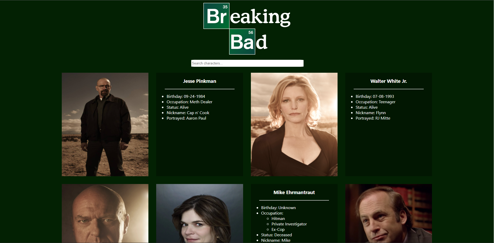

# ReactJS Breaking Bad App

This is a React begginer project for practicing the most basic React concepts. 
It's an interactive gallery of pictures from the characters of the Breaking Bad TV show where the user can click a character card to flip it around and view detailed information on that character such as name, nickname, date of birth, actor name, etc. 
The user can filter the displayed character list by searching for characters by name in the search input at the top that makes the character grid update with every letter inserted by the user. 
All character data is retrieved from the Breaking Bad API available at breakingbadapi.com

This web app was built with:
* ReactJS
* React Hooks
* Axios
* CSS Grid
* Css Animation
* Breaking Bad API

Click <a href="https://adtx.github.io/breaking_bad_app_reactjs/" target="_blank">here</a> to try out the app for yourself.
